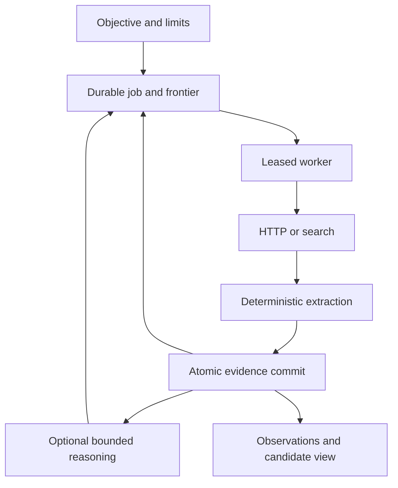

# Architecture hypothesis and implementation

Decision date: 2026-09-12. Implemented version: 0.1.0.

## Runtime boundary

The first deployment is a trusted-operator service on one Linux host with local durable
storage. Python was selected for its HTTP, parsing, data-validation and model ecosystem,
and because the smallest integration could be exercised with real process and network
failures. This choice does not make a Python agent framework the system of record.

FastAPI serves requests. Independent worker processes execute persistent tasks. The CLI
uses the same Engine and Store. Each job permits one active task at a time; different jobs
can run across workers. This bounds per-job budget and research-state races without a
distributed scheduler. SQLite's short `BEGIN IMMEDIATE` transactions serialize writes.

## Reuse and custom code

- HTTPX/HTTPCore own HTTP, TLS, connection pooling and streaming. A small public transport
  adapter pins validated IPs through HTTPCore's network backend extension point.
- Beautiful Soup owns HTML parsing; Python's CSV/JSON libraries own structured parsing.
- Protego owns robots rule parsing, including wildcard precedence and crawl delays.
- Pydantic validates specifications, extraction output and model proposals.
- SQLite owns transactions, persistence and recovery; FastAPI/Uvicorn own the HTTP API.
- SearXNG is an optional external search service. A small adapter consumes its API.
- Model reasoning uses a constrained Chat Completions contract; provider routing can be
  supplied by a local server or an external compatible gateway.
- Custom work is the harvesting state machine, observation history, scope policy, source
  frontier and budget accounting. It is not a generic distributed queue implementation.

The source audit records why a crawler's request queue was not made authoritative for
evidence commits. Crawlee remains the strongest candidate for a future browser/large-crawl
adapter. PostgreSQL becomes warranted when measured concurrency, retention or multi-host
requirements exceed this implementation. Do not claim the current Store is portable SQL.

## Commit and failure semantics

1. Claim a task in a transaction and issue a random lease token.
2. Reserve each network request before dispatch; persist retry counts and budget usage.
3. Acquire outside the transaction, subject to scope, robots, throttling and size checks.
4. Parse with deterministic adapters; create observations and follow-up proposals.
5. Commit the raw body, capture, observations, sightings, follow-up tasks, task completion,
   and corresponding events in one transaction. An invalid or expired token rejects it.
6. If a worker dies, its lease expires. Another worker reclaims the task up to the attempt
   limit. A heartbeat normally extends a lease every 15 seconds; default lease is 120s.

Acquisition is **at least once** across crashes. An external server may receive a GET
that the local worker never records as a capture. Database results are idempotent under
the task/observation keys. There is no claim of exactly-once external execution. Model
calls have the same uncertain-outcome problem; reserved cost is not refunded on failure.

`completed`, `partial`, `failed`, `cancelled`, `budget_exhausted`, and `plateau` are terminal.
Job creation is idempotent only when the caller provides the same key and spec. Changing
the spec under the same key is rejected. Reprocessing a terminal job requires a new job.

## Evidence and reconciliation

Captured response representations (after bounded content decoding) are content-addressed BLOBs in SQLite for the milestone. This allows atomic
evidence/result commits and coherent backups. Bounded responses keep individual writes
manageable. This deliberately trades large-scale object storage efficiency for a smaller,
testable failure surface. Object storage needs a staged-write protocol before adoption.

Observations retain field, typed value, evidence, locator, method, extractor version,
confidence and source URL. Sightings connect an observation to every capture where it was
seen. Canonical read views use the latest capture from each source; disagreement produces
multiple candidates and an unset canonical value. This is neither voting nor truth scoring.

## Research controller

Objective-only jobs first search through configured SearXNG. Retrieval and extraction remain
deterministic. Reasoning tasks receive bounded source text, a sample of existing observations,
requested-field gaps, recent decisions and visited/queued sources. The model proposes
quoted claims, leads, queries, gaps and contradiction notes. Proposals cannot alter budgets,
host policy, executable code, authentication or operator settings.

Literal quote checks reject ungrounded model quotations. They cannot prove entailment.
The result is a candidate observation. Primary-source preference is requested in the
reasoning prompt and expressed in leads; it is not a calibrated authority ranking.
Domain diversity is a hostname heuristic, not proof of source independence. Research
stops on exhausted frontier, limits, cancellation, or consecutive pages with no novel
observations. New wording/metadata can count as novelty; calibrated information gain is
future work. No quality guarantee follows from the existence of this loop.

## Scheduling and refresh

Continuous jobs create a durable schedule. The next generation starts only after the
previous job is terminal; missed intervals coalesce into one next run. Refresh starts from
the original seeds/discovery objective, retaining old evidence and using conditional HTTP
requests when validators are present. Schedule cancellation is separate from cancelling
one generation. Deletion detection and selective field freshness are deferred.

## Boundaries to revisit

The implementation intentionally has no Redis, vector database, browser pool, autonomous
shell, agent framework, graph database or distributed workflow service. Each would need
evidence that it solves an observed limitation better than the present adapter boundaries.
The first likely changes are streaming record extraction, improved identity semantics,
quality benchmarks, explicit source refresh policy, and storage/concurrency measurements.
